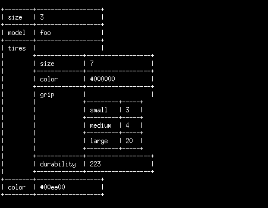

# CoffeeScript Terminal Thingies

These are some tiny helpers for printing things to the terminal when
using CoffeeScript on the server.

## Features

### Color Printing

        colors = require './colors'
        
        colors.cprint(['FG_GREEN', 'BG_RED'], 'foobar')
        colors.cprint(['FG_BLUE'], 'barfoo')

### Printing Objects as Nested Tables

        tb = require './toolbox'
        
        car =
            size: 3
            model: 'foo'
            tires:
                size: 7
                color: '#000000'
                grip:
                    small: 3
                    medium: 4
                    large: 20
                durability: 223
            color: '#00ee00'

        console.log tb.table(obj=car)

## Disclaimer

Not much love and care went into this. There are no tests either. Use at
your own risk.

---------------------------------------------------------------------------

This is probably the only kind of thing that CoffeeScript is useful for.
Oh snap! Has that really just been said?!
